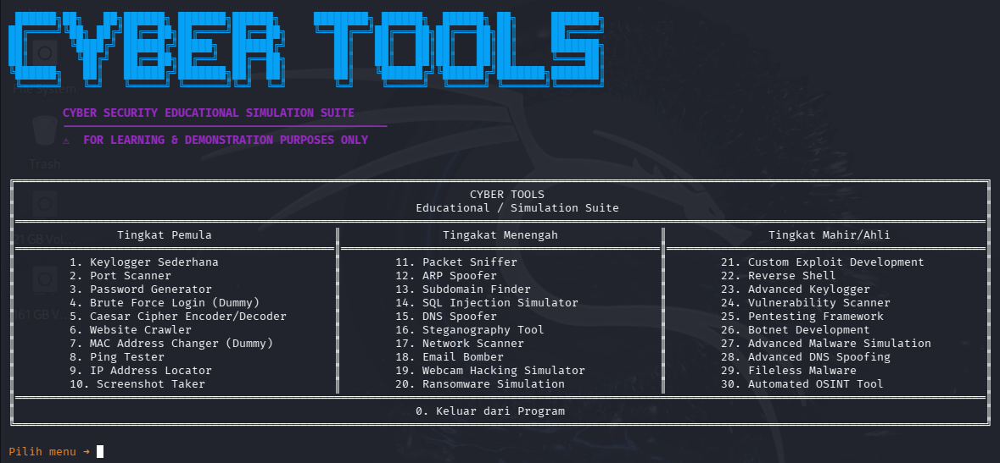

# Cyber Tools: Educational / Simulation Suite (Python)

Cyber Tools adalah koleksi alat siber edukasi dan simulasi yang dirancang untuk membantu pengguna memahami konsep-konsep keamanan siber dan cara kerja alat-alat siber umum dalam lingkungan yang aman dan terkendali. Aplikasi ini tersedia dalam versi Graphical User Interface (GUI) yang modern dan versi Command Line Interface (CLI) yang sederhana.Fitur UtamaAplikasi ini mencakup 30 alat siber yang dibagi menjadi tiga kategori, dengan implementasi yang aman dan bersifat simulasi di mana pun ada potensi risiko.

---

## 📦 Fitur

- 30 Fitur hacking & pentesting (CLI & GUI)
- Edukasi & simulasi serangan siber
- Mendukung Windows, Linux, dan macOS

---

## 🖥️ Versi

- **CLI Version:** `tools_cli.py`
- **GUI Version:** `tools_gui.py`

---

## 📸 Preview Aplikasi

<p align="center">
  
</p>

<p align="center">
  <i>Tampilan CLI Cyber Tools</i>
</p>

---

## ⚙️ Instalasi

### Windows

1. Pastikan sudah menginstal [Python 3](https://www.python.org/downloads/).

2. Unduh repo ini atau clone:

   ```bash
   git clone https://github.com/pangeran-droid/Cyber-Tools.git
   cd Cyber-Tools
   ```

3. Buat virtual environment

   ```bash
   python -m venv .venv
   .venv\Scripts\activate
   ```

4. Install depensi

   ```bash
   pip install -r requirements.txt
   ```

5. Jalankan CLI:

   ```bash
   python tools_cli.py
   ```

6. Jalankan GUI:

   ```bash
   python tools_gui.py
   ```

---

### Linux / macOS

1. Pastikan sudah menginstal Python 3.

2. Unduh repo ini atau clone:

   ```bash
   git clone https://github.com/pangeran-droid/Cyber-Tools.git
   cd Cyber-Tools
   ```

3. Buat virtual environment

   ```bash
   python3 -m venv .venv
   source .venv/bin/activate
   ```

4. Install depensi

   ```bash
   pip install -r requirements.txt
   ```

5. Beri izin eksekusi (opsional):

   ```bash
   chmod +x tools_cli.py
   chmod +x tools_gui.py
   ```

6. Jalankan CLI:

   ```bash
   ./tools_cli.py
   ```

7. Jalankan GUI:

   ```bash
   python3 tools_gui.py
   ```

---

## ⚠️ DISCLAIMER

**Fitur Simulasi ⚠️Sebagian besar fitur tingkat menengah dan mahir diimplementasikan sebagai simulasi untuk tujuan edukasi dan keamanan. Ini berarti:Tidak ada operasi berbahaya yang benar-benar dilakukan pada sistem atau jaringan Anda.Tidak ada data sensitif nyata yang direkam atau dikirim (misalnya, email, kredensial).Output dan perilaku dimaksudkan untuk menunjukkan konsep dan cara kerja alat-alat tersebut.Mohon gunakan alat ini secara bertanggung jawab dan hanya untuk tujuan edukasi atau penelitian dalam lingkungan yang terkontrol.**

> **Gunakan script ini hanya untuk tujuan pembelajaran, pengujian keamanan pada jaringan atau sistem yang Anda miliki atau memiliki izin eksplisit untuk menguji. Penulis tidak bertanggung jawab atas penyalahgunaan.**

---

## 📜 Lisensi

MIT License
